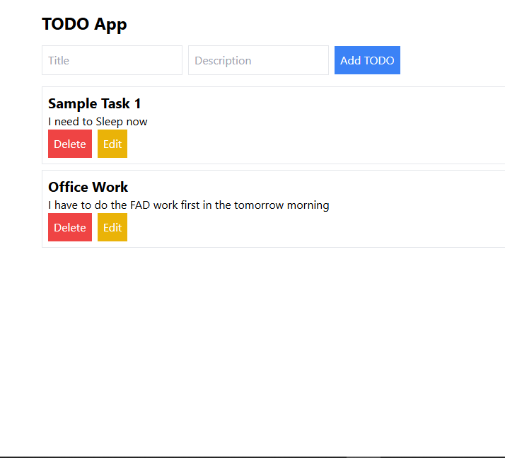

# TODO App



## Description

This is a simple TODO application built using the OERN stack (Oracle, Express, React, Node.js). The application allows users to create, read, update, and delete (CRUD) tasks.

## Features

- Add new tasks with a title and description
- Edit existing tasks
- Delete tasks
- View all tasks

## Technologies Used

- **Frontend:** React, Tailwind CSS
- **Backend:** Node.js, Express
- **Database:** OracleDB

## Installation

1. **Clone the repository:**

   ```sh
   git clone https://github.com/rabiulrafi/todo-app.git
   cd todo-app
   ```
